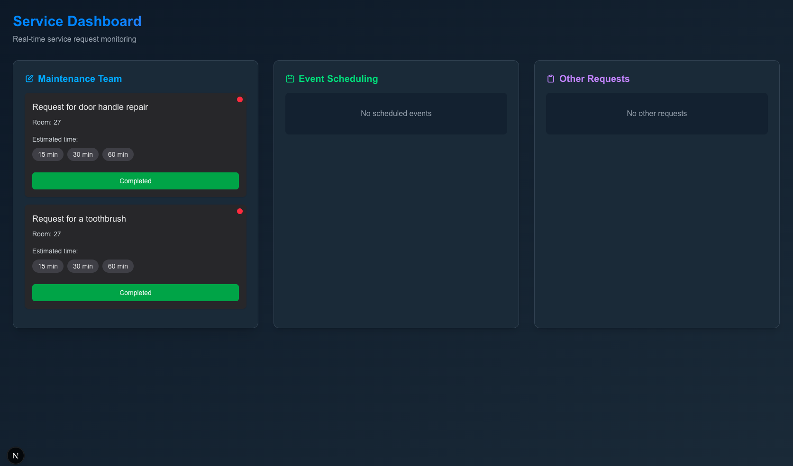

# Botler - AI Hotel Receptionist & Personal Assistant



## Overview

Botler is an intelligent AI hotel receptionist and personal assistant designed to streamline day-to-day hotel operations. It automates common tasks, enhances guest experiences, and improves staff efficiency through a combination of voice AI, web interfaces, and automated services.

## Features

### 🔧 Maintenance Request Management

- Real-time service request monitoring via an intuitive dashboard
- Automatic notification system for maintenance staff
- Outbound calls to notify employees of new tasks
- WhatsApp notifications with estimated completion times

### 🚗 Transportation Services

- Automated Uber booking through Selenium automation
- Customizable destination selection

### 🍽️ Restaurant Reservations

- Integration with Cal.com for restaurant booking
- Automated reservation management

### 📞 Call Handling

- AI-powered voice conversations using ElevenLabs
- Intelligent call routing and redirection
- Seamless handoff to human staff when needed

## System Architecture

Botler consists of three main components:

1. **Frontend** (Next.js)

   - Modern, responsive dashboard interface
   - Real-time service request monitoring
   - Task management and status tracking

2. **Call Server** (Fastify)

   - Handles inbound and outbound calls via Twilio
   - Integrates with ElevenLabs for conversational AI
   - Manages call redirection and transfers

3. **Backend Services** (Flask)
   - Handles Uber booking via Selenium
   - Manages restaurant reservations via Cal.com API
   - Provides API endpoints for the frontend

## Getting Started

### Prerequisites

- Node.js (v18+)
- Python (v3.8+)
- Twilio account
- ElevenLabs account
- Cal.com account (for restaurant bookings)

### Installation

1. Clone the repository:

   ```bash
   git clone https://github.com/Texseractrum/Botler.git
   cd Botler
   ```

2. Set up environment variables:

   - Create `.env` files in both `callserver/` and `frontend/` directories
   - Add your API keys and credentials (see `.env.example` files)

3. Install dependencies:

   ```bash
   # Frontend
   cd frontend
   npm install

   # Call Server
   cd ../callserver
   npm install

   # Backend
   cd ..
   pip install -r requirements.txt
   ```

4. Start the services:

   ```bash
   # Start the frontend
   cd frontend
   npm run dev

   # Start the call server
   cd ../callserver
   node index.js

   # Start the outbound call server
   node outbound.js

   # Start the backend
   cd ..
   python main.py
   ```

## Configuration

### Twilio Setup

1. Create a Twilio account and purchase a phone number
2. Configure your Twilio number to point to your deployed call server
3. Add your Twilio credentials to the environment variables

### ElevenLabs Setup

1. Create an ElevenLabs account
2. Create a conversational agent
3. Add your ElevenLabs API key and agent ID to the environment variables

## License

This project is licensed under the MIT License - see the [LICENSE](LICENSE) file for details.

## Acknowledgments

- [Twilio](https://www.twilio.com/) for call handling
- [ElevenLabs](https://elevenlabs.io/) for conversational AI
- [Next.js](https://nextjs.org/) for the frontend framework
- [Fastify](https://www.fastify.io/) for the call server
- [Flask](https://flask.palletsprojects.com/) for the backend services
